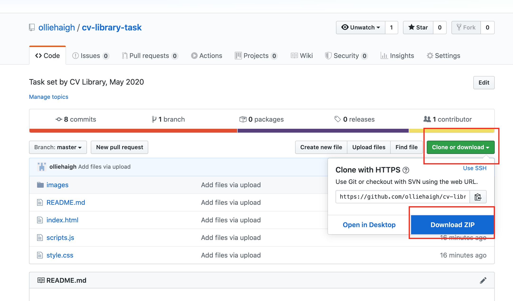

# CV Library Task
## by Ollie Haigh
Please see above for the files used to create the CV Library task.

To access the files please click the 'Clone or download' button and then 'Download Zip'.

The files contain all of the HTML, CSS and JavaScript used on this task. There was no use of CSS or JS frameworks and the JS is Vanilla.

I hope you like what I have achieved and look forward to your feedback!